# クラス設計

本書は `SEQUENCE.md` と `SPEC.md` を元に、`orchestrator`の内部クラス構成を定義する。
`mail`パッケージは既存モジュールとして扱い、`register_user` / `list_users` / `send_mail` / `check_mail` / `receive_mail` のみを利用する（SPEC.md 7章）。

## 1. クラス図

```mermaid
classDiagram
    class OrchestratorMain {
        +main(args: list~str~) int
        -run_watch_mode() void
        -run_once_mode() void
    }

    class PathResolver {
        +orchestrator_dir: Path
        +project_root: Path
        +mail_dir: Path
        -resolve_project_path(config: OrchestratorConfig) Path
    }

    class OrchestratorConfig {
        +mail_check_interval_sec: int
        +cli_timeout_sec: int
        +reply_check_timeout_sec: int
        +max_round_trips: int
        +max_retries: int
        +max_run_duration_sec: int
        +agents: list~AgentDefinition~
        +project_path: str
        +logs_dir: str
        +checkpoints_dir: str
        +load(path: Path) OrchestratorConfig
        +validate() void
    }

    class AgentDefinition {
        +name: str
        +uid: str
        +command: list~str~
        +order_index: int
    }

    class MailWatcher {
        -mail_module: MailModuleAdapter
        +poll_unread(agents: list~AgentDefinition~) list~AgentDefinition~
        +has_unread(agent: AgentDefinition) int
    }

    class MailModuleAdapter {
        +register_user(name: str) str
        +list_users() list~dict~
        +send_mail(sender_uid, recipient_uid, subject, body) int
        +check_mail(uid: str) int
        +receive_mail(uid: str) list~dict~
    }

    class CliLauncher {
        -resolver: CliPathResolver
        +launch(agent: AgentDefinition, job_id: str) LaunchedProcess
        -build_fixed_instruction(agent: AgentDefinition, uid: str) str
        -build_subprocess_env() dict
    }

    class CliPathResolver {
        +resolve(agent_name: str, configured_command: str) list~str~
        -check_config_command() list~str~
        -check_windows_path() list~str~
        -check_default_command_name() list~str~
    }

    class LaunchedProcess {
        +pid: int
        +start_time: datetime
        +agent: AgentDefinition
        +job_id: str
        +origin_mail_id: int
        +wait(timeout_sec: int) ProcessResult
        +terminate() void
    }

    class ProcessResult {
        +exit_code: int
        +timed_out: bool
        +duration_sec: float
    }

    class ReplyVerifier {
        +wait_for_reply(expected: ExpectedReply, timeout_sec: int) ReplyCheckResult
        -matches(mail: dict, expected: ExpectedReply) bool
    }

    class ExpectedReply {
        +job_id: str
        +sender_uid: str
        +recipient_uid: str
        +origin_mail_id: int
        +not_before: datetime
    }

    class ReplyCheckResult {
        +found: bool
        +reply_mail_id: int
    }

    class OutcomeClassifier {
        +classify(launch: LaunchedProcess, result: ProcessResult, reply: ReplyCheckResult) OutcomeStatus
    }

    class OutcomeStatus {
        <<enumeration>>
        NO_WORK
        DELIVERY_FAILED
        FAILED
        TIMEOUT
        NO_REPLY
        HUMAN_REQUIRED
        SUCCESS
    }

    class RetryPolicy {
        +max_retries: int
        +should_retry(status: OutcomeStatus, attempt: int, mail_received: bool) bool
    }

    class ErrorNotifier {
        -mail_module: MailModuleAdapter
        -system_sender_uid: str
        +notify(job_id: str, origin_mail_id: int, origin_sender_uid: str, status: OutcomeStatus, detail: NotificationDetail) void
        -build_subject(job_id: str, status: OutcomeStatus) str
        -build_body(detail: NotificationDetail) str
        -is_terminal_recipient_invalid(recipient_uid: str) bool
    }

    class NotificationDetail {
        +target_agent_name: str
        +target_agent_uid: str
        +failed_stage: str
        +reason: str
        +exit_code: int
        +duration_sec: float
        +retry_count: int
        +last_attempt_at: datetime
        +origin_mail_status: str
        +recommended_action: str
    }

    class RuntimeStateStore {
        -runtime_dir: Path
        +save(state: RunningAgentState) void
        +load_all() list~RunningAgentState~
        +remove(job_id: str) void
        +read_stop_request() bool
        +clear_stop_request() void
    }

    class RunningAgentState {
        +pid: int
        +process_start_time: datetime
        +agent_name: str
        +agent_uid: str
        +job_id: str
        +origin_mail_id: int
        +launch_command: list~str~
        +recorded_at: datetime
        +retry_count: int
    }

    class StaleRecoveryService {
        -runtime_store: RuntimeStateStore
        -mail_module: MailModuleAdapter
        +recover_on_startup() list~RecoveryAction~
        -is_process_alive(state: RunningAgentState) bool
    }

    class RecoveryAction {
        <<enumeration>>
        REQUEUE
        NOTIFY_ORIGIN_SENDER
        MARK_COMPLETED
    }

    class CheckpointStore {
        -checkpoints_dir: Path
        +save(checkpoint: Checkpoint) void
        +load(job_id: str) Checkpoint
    }

    class Checkpoint {
        +job_id: str
        +purpose: str
        +current_state: str
        +decisions: list~str~
        +artifacts: list~str~
        +open_issues: list~str~
        +next_actions: list~str~
        +updated_at: datetime
    }

    class JobLogger {
        -logs_dir: Path
        +log_launch(entry: LogEntry) void
        +log_outcome(entry: LogEntry) void
    }

    class LogEntry {
        +timestamp: datetime
        +job_id: str
        +mail_id: int
        +agent_name: str
        +command_summary: str
        +started_at: datetime
        +finished_at: datetime
        +exit_code: int
        +result: str
        +changed_files: list~str~
        +error: str
        +next_recipient: str
    }

    class DispatchCycle {
        -watcher: MailWatcher
        -launcher: CliLauncher
        -verifier: ReplyVerifier
        -classifier: OutcomeClassifier
        -retry_policy: RetryPolicy
        -notifier: ErrorNotifier
        -logger: JobLogger
        -checkpoint_store: CheckpointStore
        +run_one_pass(agents: list~AgentDefinition~) void
        -process_agent(agent: AgentDefinition) void
    }

    OrchestratorMain --> OrchestratorConfig
    OrchestratorMain --> PathResolver
    OrchestratorMain --> DispatchCycle
    OrchestratorMain --> StaleRecoveryService
    OrchestratorMain --> RuntimeStateStore
    OrchestratorConfig --> AgentDefinition
    DispatchCycle --> MailWatcher
    DispatchCycle --> CliLauncher
    DispatchCycle --> ReplyVerifier
    DispatchCycle --> OutcomeClassifier
    DispatchCycle --> RetryPolicy
    DispatchCycle --> ErrorNotifier
    DispatchCycle --> JobLogger
    DispatchCycle --> CheckpointStore
    DispatchCycle --> RuntimeStateStore
    MailWatcher --> MailModuleAdapter
    ErrorNotifier --> MailModuleAdapter
    ErrorNotifier --> NotificationDetail
    ReplyVerifier --> MailModuleAdapter
    ReplyVerifier --> ExpectedReply
    ReplyVerifier --> ReplyCheckResult
    CliLauncher --> CliPathResolver
    CliLauncher --> LaunchedProcess
    LaunchedProcess --> ProcessResult
    OutcomeClassifier --> OutcomeStatus
    RetryPolicy --> OutcomeStatus
    StaleRecoveryService --> RuntimeStateStore
    StaleRecoveryService --> MailModuleAdapter
    StaleRecoveryService --> RecoveryAction
    RuntimeStateStore --> RunningAgentState
    CheckpointStore --> Checkpoint
    JobLogger --> LogEntry
```

## 2. クラス責務一覧

| クラス | 責務 | 対応するSPEC.md章 |
|---|---|---|
| `OrchestratorMain` | エントリポイント。常時監視モード／一巡モードの選択と起動 | 13章, 14章 |
| `PathResolver` | `orchestrator.py`自身の位置基準でのパス解決、`project_path`の正規化・範囲チェック | 5章, 6章 |
| `OrchestratorConfig` / `AgentDefinition` | `config.json`の読み込みと安全な既定値の適用、エージェント定義順の保持 | 10章, 16章 |
| `MailWatcher` | `check_mail`による未読監視、エージェント定義順・メールID昇順の走査 | 15章, 16章 |
| `MailModuleAdapter` | `mail`パッケージ関数への薄いラッパー（唯一の依存境界） | 7章 |
| `CliLauncher` / `CliPathResolver` | CLI検出順（config→PATH→既定名）、`subprocess`によるコマンド・引数分離起動、固定指示の生成、UTF-8環境変数の設定 | 11章, 12章, 21章 |
| `LaunchedProcess` / `ProcessResult` | 起動済みプロセスの待機・終了コード・タイムアウト検出 | 12章, 15章 |
| `ReplyVerifier` / `ExpectedReply` / `ReplyCheckResult` | 返信確認タイムアウト内での返信メール照合（送受信者UID・依頼ID・メールID・作成時刻） | 30章「返信メールの確認」 |
| `OutcomeClassifier` / `OutcomeStatus` | 起動可否・終了コード・タイムアウト・返信有無から状態を確定 | 26章, 30章 |
| `RetryPolicy` | 未受信が明らかな場合のみ最大再試行回数まで再試行を許可 | 10章, 26章 |
| `ErrorNotifier` / `NotificationDetail` | システム送信者としてのエラー通知作成、秘密情報除去、再帰通知防止 | 30章 |
| `RuntimeStateStore` / `RunningAgentState` | `runtime/`への実行中情報の保存・照会、`stop.request`の読み取り | 24章 |
| `StaleRecoveryService` / `RecoveryAction` | 起動時のSTALE判定とPID+開始時刻照合、再処理・通知・完了整理への振り分け | 24章 |
| `CheckpointStore` / `Checkpoint` | `checkpoints/`への引継ぎ情報の保存・読込 | 20章 |
| `JobLogger` / `LogEntry` | `logs/`への実行記録、秘密情報を含めない | 23章 |
| `DispatchCycle` | 1エージェント分の「監視→起動→待機→判定→再試行/通知→ログ→引継ぎ更新」の一連処理を束ねる | 15章, 16章 |

## 3. 設計上の注意

* `MailModuleAdapter`は`mail`パッケージの公開関数のみを呼び出し、`mail`側のテーブル構造へ直接アクセスしない（SPEC.md 7章「メールシステム本体へ、AI起動処理やオーケストレーション処理を追加してはならない」）。
* `orchestrator`を削除しても`mail`単体が動作するよう、依存方向は`orchestrator → mail`の一方向のみとする。
* `PathResolver`はカレントディレクトリを一切参照しない。すべての相対パス解決は`orchestrator.py`の実体パスを起点とする。
* `OutcomeStatus`の`HUMAN_REQUIRED`は、認証切れ・対象ファイル不足・破壊的操作・判定不能な場合に加え、エラー通知自体の送信失敗や無効な送信者UIDの場合にも設定される（`ErrorNotifier`側で終端化）。
* `RetryPolicy`は`DispatchCycle`からのみ呼び出され、`mail_received`（AIがメールを受信・既読化したか）が`True`の場合は`should_retry`が常に`False`を返す。`mail_received`は`OutcomeStatus`が`DELIVERY_FAILED`（CLI起動不能など未受信が明らかな場合）かどうかから`DispatchCycle`が判定して渡す。
