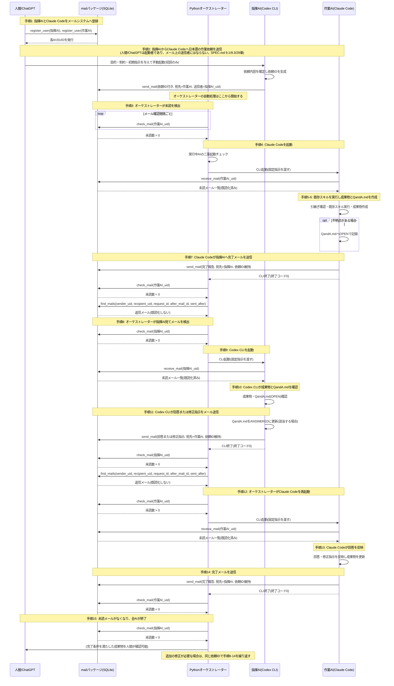
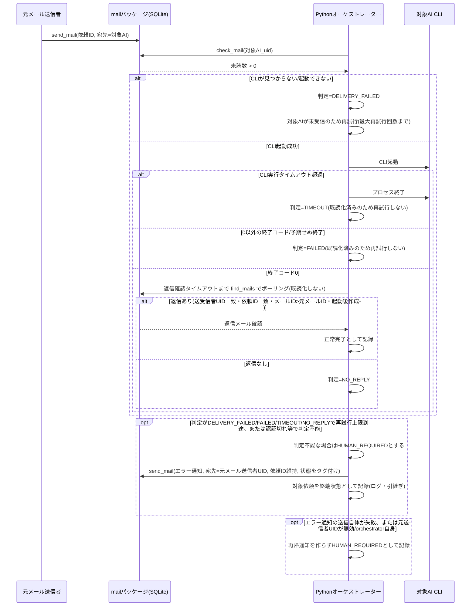
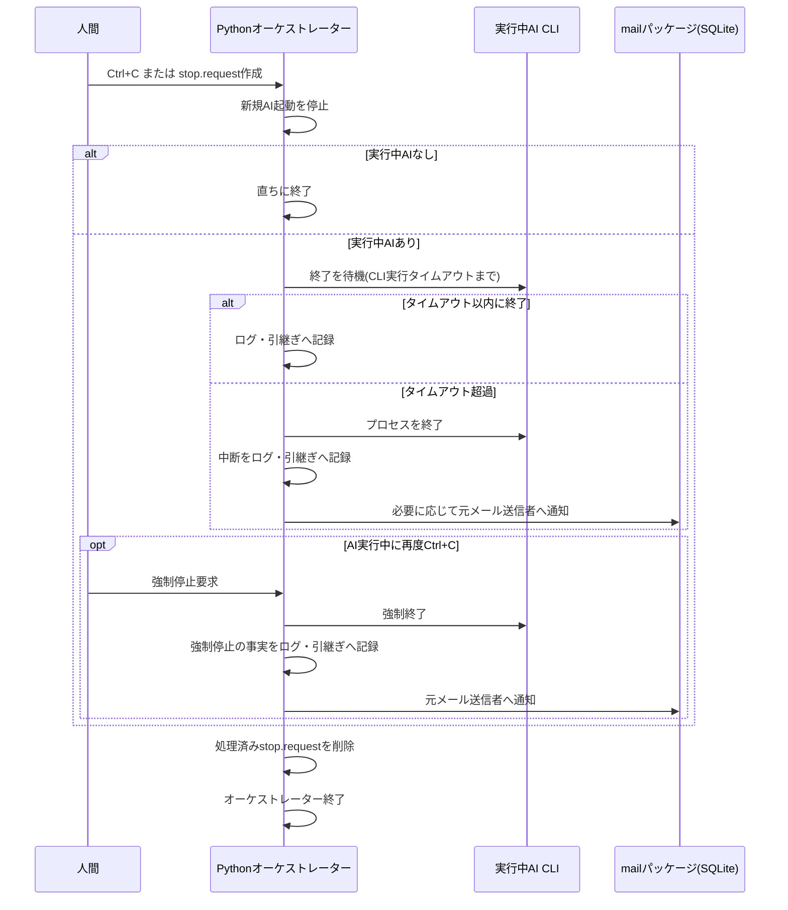
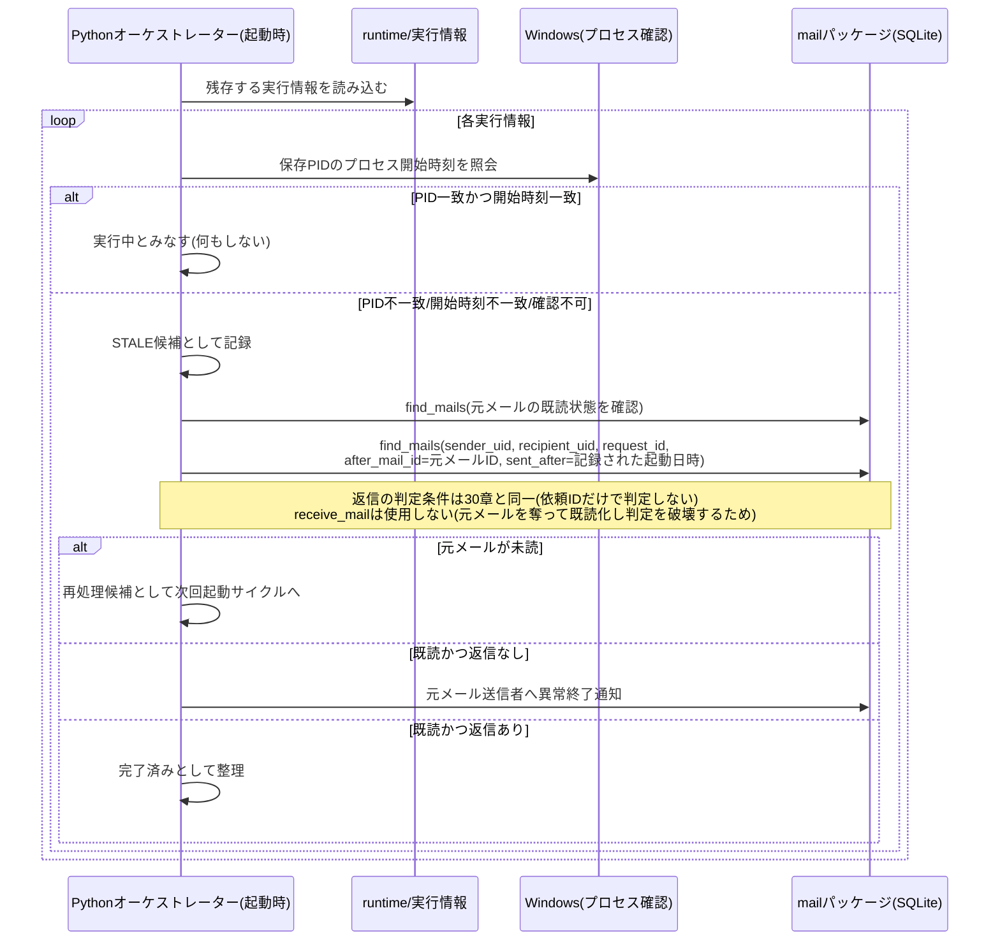

# シーケンス図

本書は `USECASE.md` と `SPEC.md` を元に、主要フローと分岐をシーケンス図で示す。

## 1. 全体の基本フロー（初期動作確認、SPEC.md 29章の15手順に対応）



## 2. CLI異常時の送信元通知フロー（SPEC.md 30章対応）



## 2.5 RATE_LIMITED時の代替AI引継ぎフロー

```mermaid
sequenceDiagram
    participant Orc as オーケストレーター
    participant CLI as 現担当CLI
    participant Adapter as CLIアダプター
    participant Log as logs/
    participant Mail as メール
    participant Alt as 代替AI

    Orc->>CLI: stdout/stderrを個別PIPEで読み取り
    CLI-->>Orc: 終了（出力は逐次保存・上限後も読み捨て）
    Orc->>Adapter: 有限長末尾と終了情報を判定
    Adapter-->>Orc: RATE_LIMITED + rule_id + evidence
    Orc->>Log: 出力相対パス・SHA-256・根拠・担当履歴をJSONL記録
    alt 未訪問の代替AIあり、引継ぎ上限未到達
        Orc->>Orc: HANDOFF_PENDINGを永続化
        Orc->>Mail: 同じ依頼IDのHANDOFFメールを送信
        Orc->>Orc: HANDOFF_SENTと担当履歴を永続化
        Mail-->>Alt: 未読の引継ぎメール
        Alt->>Mail: receive_mailで取得・処理
    else 候補なし／循環／上限／送信・保存失敗
        Orc->>Orc: HUMAN_REQUIREDを永続化
        Orc->>Mail: 元送信者へマスキング済み通知
    end
```

判定根拠はCLIアダプターが返し、共通分類器は終了コードだけでRATE_LIMITEDを作らない。RATE_LIMITEDでは同じAIの通常再試行を行わない。

## 3. 常時監視モードの停止フロー（SPEC.md 25章対応）



## 4. STALE実行情報の復旧フロー（SPEC.md 24章対応）


