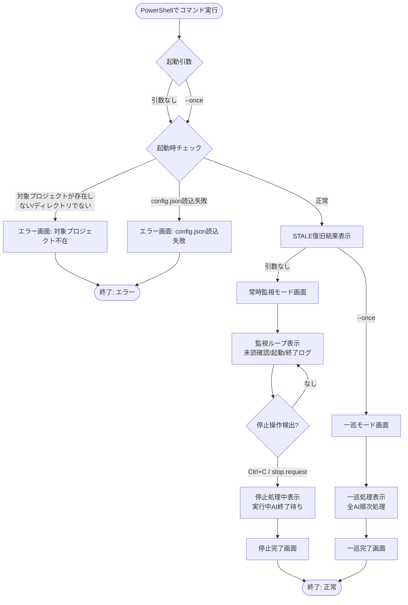

# UI設計（CLI/コンソール）

本システムはGUIを持たない（SPEC.md 27章「複雑なGUI」「Web管理画面」は対象外）。
「UI」は、人間がPowerShellから操作するコンソール入出力を指す。

## 1. 画面（実行モード）遷移

## 2. 画面定義

### 2.1 常時監視モード画面

- **起動コマンド**: `python .\orchestrator\orchestrator.py`
- **表示内容**:
  - 起動時: 検出したプロジェクトルート、`mail`フォルダ、読み込んだ`config.json`の要約
  - 監視サイクルごと: 確認時刻、対象AI名、未読数（0件時は表示を省略または簡潔なハートビートのみ）
  - AI起動時: 起動したAI名、依頼ID、開始時刻
  - AI終了時: 終了コード、実行時間、判定結果（`SUCCESS` / `NO_REPLY` / `TIMEOUT` / `FAILED` / `DELIVERY_FAILED` / `HUMAN_REQUIRED`）
  - エラー通知送信時: 送信先UID、状態、依頼ID
- **正常系**: 未読メールがあるAIを`config.json`のエージェント定義順に起動し、結果を1行ずつ追記表示する。
- **空状態**: 全AIの未読が0件の場合、「待機中」を示す簡潔な表示のみとし、AIやLLMを呼び出さない（SPEC.md 15章）。
  - **未着手状態（コールドスタート）**: 全AIの未読が0件で、**かつ**`find_mails`により`config.json`のエージェントが送信者または受信者となるメールの履歴が1件も存在しないことを確認できた場合、「指揮AIを手動起動して最初の作業依頼を送信してください」という趣旨の案内を、そのプロセスの実行中に1度だけ表示する。最初の依頼メールの送信はオーケストレーターの役割ではないため、案内表示以外の動作は行わない（SPEC.md 9.1, 29章手順2）。
  - 履歴が1件でも存在する場合は、作業が進行中または完了済みであり未着手ではないため、この案内を表示せず「待機中」の表示のみとする。
  - 履歴の有無を判定できない場合（`find_mails`が失敗した場合など）は、誤った案内を避けるため案内を表示せず「待機中」の表示のみとし、判定できなかった旨を`orchestrator/logs/`へ記録する。
- **エラー状態**:
  - 対象プロジェクトが存在しない、またはディレクトリでない → 起動直後にエラーメッセージを表示しAIを起動せず終了する（SPEC.md 6章）。
  - `config.json`の読込・検証に失敗 → 安全な既定値で継続可能な項目は既定値を使い、対象パスが不正な場合はエラー表示のうえ終了する。
  - CLIが見つからない → 対象AIがまだメールを受信していないことが明らかなため、最大再試行回数まで再試行し、その都度試行回数をコンソールへ表示する。上限到達時は`DELIVERY_FAILED`を表示し、元メールの送信者UIDへエラー通知を送信したことを表示する。監視自体は継続し、他AIの処理を妨げない（SPEC.md 26章, 30章）。
- **権限なし状態**: `logs/`・`checkpoints/`・`runtime/`への書き込み権限がない場合、該当ディレクトリ名と原因を明示したエラーを表示し、オーケストレーター自体を安全に終了する（成果物やメール状態を不整合のまま進めない）。これはAI単位の処理継続とは別次元の致命的エラーであり、常時監視モード・一巡モードのいずれでも即座に監視ループ／一巡処理を打ち切って終了する。個々のAI起動失敗（CLI未検出・タイムアウト等）とは異なり、代替AIの処理継続では回避できないため最優先で扱う。
- **停止操作**: Ctrl+Cまたは`orchestrator/runtime/stop.request`の作成を検出すると「停止要求を受け付けました。実行中のAI終了を待機します」と表示する。再度Ctrl+Cを受けた場合は「強制停止します」と表示してから終了する。

### 2.2 一巡モード画面

- **起動コマンド**: `python .\orchestrator\orchestrator.py --once`
- **表示内容**: 常時監視モードと同様の起動時要約・起動ログ・終了ログを、全AI分の処理が終わるまで表示し、最後に一巡完了の要約（処理したAI数、成功/失敗件数）を表示して終了する。
- **正常系**: 全AIの未読を一度確認し、必要なAIを起動して結果を確認したうえで終了する。起動したAIが返信を作成する前には終了しない。
- **空状態**: 起動直前の競合で未読メールが0になった場合、「対象なし（NO_WORK）」と表示して正常終了する（SPEC.md 14章）。
- **エラー状態**: 常時監視モードの2.1と同じ分類を用いる。個々のAI単位のエラー（`DELIVERY_FAILED`・`TIMEOUT`・`FAILED`・`NO_REPLY`など）発生後も、他AIの一巡処理は継続し、最後にまとめて表示する。
- **権限なし状態**: 2.1と同じくオーケストレーター全体の致命的エラーとして扱い、一巡処理を打ち切って直ちに終了する。

### 2.3 起動時チェック・STALE復旧結果表示

- **表示内容**: 起動時に検出した`STALE`実行情報の件数と、それぞれの振り分け結果（再処理候補／異常終了通知送信済み／完了済み整理）を一覧表示する（SPEC.md 24章）。
- **空状態**: `STALE`該当なしの場合は表示を省略する。

## 3. 出力先とログの関係

コンソール出力は簡潔な要約に限定し、詳細は`orchestrator/logs/`へ記録する（SPEC.md 23章）。コンソールにもログにも、APIキー・認証情報・Cookie・秘密の環境変数を出力しない。
