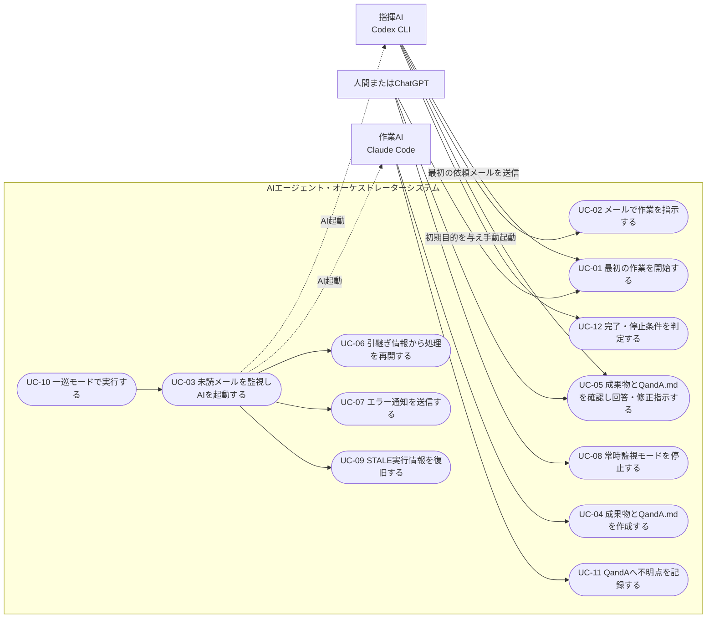

# ユースケース定義

本書は `SPEC.md` を元に、AIエージェント・オーケストレーターシステムのユースケースを定義する。

## 1. アクターとシステム境界

システム境界（`AIエージェント・オーケストレーターシステム`）は、`mail`パッケージと`orchestrator`本体の両方を含む。`Pythonオーケストレーター`はアクターではなく、システム内部の自動処理として扱う（SPEC.md 9.2）。

## 2. アクター一覧

| アクター | 説明 | 対応するSPEC.md章 |
|---|---|---|
| 人間またはChatGPT | 目的・制約・初期指示の指定、指揮AIの初回手動起動、最終確認、停止操作。メールシステム上の送信者にはならない | 9.1 |
| 指揮AI（Codex CLI） | 最初の作業依頼メールの作成・送信（依頼内容の確定、依頼ID生成、`send_mail`）、作業指示、成果物・QandA.md確認、回答/修正指示 | 9.3 |
| 作業AI（Claude Code） | 未読メール処理、成果物作成、QandA.md記録、報告 | 9.4 |

`Pythonオーケストレーター`（9.2）は上記アクターに駆動されるシステム内部コンポーネントであり、UC-03・UC-06・UC-07・UC-09・UC-10の実処理主体である。

## 3. ユースケース詳細

### UC-01 最初の作業を開始する

- **アクター**: 人間またはChatGPT（起動者）、指揮AI（送信者）
- **概要**: 人間またはChatGPTが目的・制約・初期指示を与えて指揮AIを1回だけ手動起動し、指揮AIが最初の作業依頼メールを作業AIへ送信する。
- **事前条件**: 指揮AIと作業AIがメールシステムへユーザー登録済み（UIDを保有）。
- **主フロー**:
  1. 人間またはChatGPTが目的・制約・初期指示を決める。
  2. 人間またはChatGPTが指揮AIを1回だけ手動で起動し、上記を与える。
  3. 指揮AIが依頼内容を確定する。
  4. 指揮AIが新しい依頼IDを生成する（`JOB-{UTC日時}-{ランダム8桁}`、SPEC.md 17章）。
  5. 指揮AIが`send_mail`を使用し、依頼IDを件名に含めた作業依頼メールを作業AI宛てに送信する。
- **事後条件**: 作業AI宛てのメールが未読状態で保存される。その送信者UIDは指揮AIのUIDである。
- **補足**: 人間またはChatGPTはメールシステム上の作業依頼送信者ではなく、指揮AIへ初期目的を与える起動者として扱う。オーケストレーターによる自動処理は、この最初のメールが送信された後から開始する。したがって、作業AIで発生したエラー通知・回答・QandA・完了報告の返信先も原則として指揮AIのUIDとなる。
- **関連**: SPEC.md 2章, 9.1, 9.3, 17章, 29章

### UC-02 メールで作業を指示する

- **アクター**: 指揮AI
- **概要**: 指揮AIが作業AIへ、具体的な作業内容をメールで指示する。
- **事前条件**: 指揮AIが起動され（初回はUC-01による手動起動、2回目以降はオーケストレーターによる起動）、作業AIからの報告など自分宛ての未読メールを確認済みであること。
- **主フロー**:
  1. 指揮AIが依頼内容を解釈する。
  2. 同じ依頼IDを維持した作業依頼メールを作業AI宛てに送信する（新規作業の場合は新しい依頼ID）。
- **事後条件**: 作業AI宛てに未読メールが存在する。
- **関連**: SPEC.md 9.3, 17章

### UC-03 未読メールを監視しAIを起動する

- **アクター**: システム（Pythonオーケストレーター）
- **概要**: 設定間隔で未読メールを確認し、未読があるAIのCLIを起動する。
- **事前条件**: `config.json`が読み込み可能であること。
- **主フロー**:
  1. `config.json`のエージェント定義順に、各AIの`check_mail(uid)`で未読数を確認する。
  2. 未読があり、かつ同じAIが実行中でない場合、対応するCLIを起動する。
  3. 起動時に固定の短い指示を渡す（SPEC.md 12章）。
  4. CLIが終了するまで監視し、終了コード・タイムアウト・返信有無を記録する。返信の有無は`find_mails`で確認し、返信メールを既読化しない（SPEC.md 7章, 30章）。
  5. AI終了後、未読数を再確認する。理由を問わず未読が残っている場合は、必要に応じて再度起動する（SPEC.md 15章）。
- **代替フロー**:
  - 1a. `project_path`で指定した対象パスが存在しない、またはディレクトリでない → AIを起動せず、元メールの送信者へUC-07（`DELIVERY_FAILED`）で通知する（SPEC.md 6章）。
  - 3a. CLIが見つからない、または起動できない → UC-07（`DELIVERY_FAILED`）
  - 4a. タイムアウトした → プロセス終了、UC-07（`TIMEOUT`）へ。AIが受信・既読化した後の失敗であるため自動再試行はしない。
  - 4b. 終了コード0だが返信確認タイムアウト内に返信がない → UC-07（`NO_REPLY`）へ。同様に自動再試行はしない。
  - 4c. 0以外の終了コード、または予期せぬ終了 → UC-07（`FAILED`）へ。同様に自動再試行はしない。
  - 4d. CLI起動失敗など、対象AIがまだメールを受信していないことが明らかな場合に限り、最大再試行回数まで起動を再試行する（3aのケース）。
- **事後条件**: 実行結果（`NO_WORK`含む）がログへ記録される。
- **関連**: SPEC.md 11章〜16章, 26章

### UC-04 成果物とQandA.mdを作成する

- **アクター**: 作業AI
- **概要**: 起動された作業AIが自分宛ての未読メールを読み、作業を実行し、成果物を保存し、必要に応じてQandA.mdへ記録した後、指揮AIへ報告する。
- **事前条件**: 作業AIのCLIがオーケストレーターにより起動済み。
- **主フロー**:
  1. `mail`パッケージで自分宛ての未読メールを`receive_mail(uid)`により取得する（取得と同時に既読化）。
  2. 引継ぎ情報（`orchestrator/checkpoints/`）があれば確認する。
  3. メール本文の指示に従い作業を実行する。必要に応じて既存スキルを使用する。
  4. 成果物を対象プロジェクト内へ保存する。
  5. 不明点があれば`QandA.md`へ記録する（UC-11）。
  6. 完了・質問・失敗など判断が必要な時点で、指揮AIへ結果をメールで報告する。報告メールには成果物の相対パスと要約だけを記載し、絶対パスや成果物全文を貼り付けない（SPEC.md 8章, 18章, 22章）。
  7. 処理対象がなくなったら終了する。
- **事後条件**: 正常完了時は成果物ファイルと指揮AI宛て報告メールが存在する。不明点があった場合に限り`QandA.md`が更新される。作業中に異常終了した場合は成果物やメールが作成されないことがあり、その場合はUC-07（エラー通知）の対象となる。
- **関連**: SPEC.md 9.4, 18章, 19章, 22章

### UC-05 成果物とQandA.mdを確認し回答・修正指示する

- **アクター**: 指揮AI（人間の介入を含む）
- **概要**: 作業AIからの報告メールを受け、成果物と`QandA.md`の`OPEN`質問を確認し、自動回答可能なら回答、そうでなければ人間へ判断を戻す。完了条件を満たさなければ修正指示を送る。
- **事前条件**: 作業AIからの報告メールが未読で存在する。
- **主フロー**:
  1. 指揮AIが必要な成果物だけを読む。
  2. `QandA.md`の`OPEN`質問を確認する。
  3. 自動回答可能な質問に回答し、状態を`ANSWERED`にする。
  4. 完了条件を満たせば完了として処理を終える。満たさなければ修正指示メールを作業AIへ送る（同じ依頼ID）。
- **代替フロー**:
  - 2a. 要求変更・破壊的操作・外部公開・課金・契約・セキュリティに関わる判断 → 人間へ処理を戻す（停止条件、SPEC.md 25章）。
  - 4a. 最大往復回数へ到達 → 自動処理を停止する。
- **事後条件**: `QandA.md`の状態更新、または修正指示メールの送信。
- **関連**: SPEC.md 9.1, 9.3, 19章, 25章

### UC-06 引継ぎ情報から処理を再開する

- **アクター**: システム（Pythonオーケストレーター起動時）／作業AI・指揮AI（再起動後）
- **概要**: PC再起動やAI再起動後も、`orchestrator/checkpoints/`の引継ぎ情報から処理を継続する。
- **事前条件**: PowerShell、PC、またはオーケストレーターの再起動後であること。対象依頼IDの引継ぎファイルは存在しなくてもよい。
- **主フロー**:
  1. 次回起動時、優先順に「引継ぎ情報 → 未回答QandA → 必要な成果物 → 対象メール」を読む。
  2. 引継ぎファイルが存在する場合は、依頼ID・目的・現在の状態・決定事項・成果物・未解決事項・次に行うことを確認する。
  3. 未解決事項に基づき処理を継続する。
- **代替フロー**:
  - 1a. 対象依頼IDの引継ぎファイルが存在しない → SQLiteメール履歴、`QandA.md`、成果物ファイルから未完了作業を確認し、引継ぎ情報なしで処理を継続する。
- **事後条件**: 引継ぎ情報の有無によらず、長い会話履歴を再構築せずに作業を継続できる。
- **関連**: SPEC.md 20章

### UC-07 エラー通知を送信する

- **アクター**: システム（Pythonオーケストレーター、システム送信者`orchestrator`として）
- **概要**: CLI起動・実行・返信確認に失敗した場合、元メールの送信者UIDへエラー通知メールを送信する。
- **事前条件**: システムユーザー`orchestrator`がメールシステムへ登録済み。
- **主フロー**:
  1. 失敗種別を判定する（`DELIVERY_FAILED` / `FAILED` / `TIMEOUT` / `NO_REPLY`）。認証切れ・対象ファイル不足・破壊的操作・人間判断の必要性など判定できない場合は`HUMAN_REQUIRED`とする。
  2. 一時的な失敗は設定回数まで再試行する（対象AIが未受信の場合のみ）。
  3. 再試行上限、またはAI受信後の失敗が確定した時点で、元メールの送信者UIDへエラー通知メールを送信する。件名に元の依頼IDと状態を含める。
  4. 本文へ次の全項目を記載する（SPEC.md 30章「本文」）: 状態、依頼ID、元メールID、元の送信者UID、処理対象AI名、処理対象UID、失敗段階、失敗理由、CLI終了コード、実行時間、再試行回数、最終試行日時、元メールの状態、推奨する次の対応。APIキー・認証トークン・Cookie・パスワード・秘密の環境変数・メール本文全文・プロンプト全文・個人情報を含む絶対パス・標準出力/標準エラーの無制限な全文は含めない（SPEC.md 30章「エラー情報の制限」）。
  5. 対象依頼を終端状態（`FAILED` / `TIMEOUT` / `NO_REPLY` / `DELIVERY_FAILED` / `HUMAN_REQUIRED`）として記録する。
- **代替フロー**:
  - 3a. 通知送信自体が失敗、または送信先UIDが無効 → 再帰通知を作らず、ログ・引継ぎへ記録し`HUMAN_REQUIRED`とする。
  - 3b. 元メールの送信者が`orchestrator`自身 → 再帰送信せず`HUMAN_REQUIRED`として人間判断状態で記録する。
- **事後条件**: 送信元AIが返信を待ち続けない。同じ失敗通知を無限に生成しない。
- **関連**: SPEC.md 30章（受け入れ条件への追加セクション全体）

### UC-08 常時監視モードを停止する

- **アクター**: 人間
- **概要**: Ctrl+Cまたは`orchestrator/runtime/stop.request`により、常時監視モードを安全に停止する。
- **事前条件**: オーケストレーターが常時監視モードで実行中。
- **主フロー**:
  1. 人間が停止操作を行う（Ctrl+Cまたは`stop.request`作成）。
  2. オーケストレーターは新規AIを起動せず、実行中AIの終了を待つ。
  3. CLI実行タイムアウト以内に終了すればログ・引継ぎへ記録して終了する。
- **代替フロー**:
  - 3a. タイムアウトまでに終了しない → プロセスを終了し、中断をログ・引継ぎへ記録、必要に応じ元メール送信者へ通知する。
  - 3b. AI実行中に再度Ctrl+Cを受けた → 強制停止し、その事実をログ・引継ぎへ記録、送信者へ通知する。
- **事後条件**: 処理済みの`stop.request`が削除される。
- **関連**: SPEC.md 25章

### UC-09 STALE実行情報を復旧する

- **アクター**: システム（Pythonオーケストレーター起動時）
- **概要**: オーケストレーター起動時、`orchestrator/runtime/`に残る実行情報のうち、対応する実プロセスが存在しないものを`STALE`として検出し、状況に応じて復旧する。
- **事前条件**: `runtime/`に前回セッションの実行情報が残っている。
- **主フロー**:
  1. 保存されたPID・プロセス開始時刻と、実プロセスの開始時刻を照合する。
  2. 一致しない、または確認できない場合は`STALE`とする。
  3. `find_mails`で元メールの既読状態と、返信の有無を確認する。返信の判定条件はUC-03・SPEC.md 30章と同一とし、依頼IDだけで判定しない。`sender_uid`に実行情報へ記録された処理対象AIのUID、`recipient_uid`に期待する返信先UID、`request_id`に依頼ID、`after_mail_id`に元メールID、`sent_after`に実行情報へ記録された起動日時を指定する。これにより、同一依頼IDの古い返信や別の送受信者間のメールを完了済みと誤判定しない。`receive_mail`は使用しない（元メールを奪って既読化し、判定自体を破壊するため。SPEC.md 24章）。
  4. 元メールが未読なら再処理候補とする。既読で返信がなければ異常終了通知を送る。返信済みなら完了済みとして整理する。
- **事後条件**: 実行時情報の不整合が解消され、次回監視サイクルへ進める。
- **関連**: SPEC.md 24章

### UC-10 一巡モードで実行する

- **アクター**: 人間（起動操作）、システム（実処理）
- **概要**: `--once`オプションで、全AIの未読メールを一度確認し、必要なAIを起動して結果を確認した後に終了する。
- **事前条件**: `python .\orchestrator\orchestrator.py --once` が実行される。
- **主フロー**:
  1. UC-03と同様に全AIの未読を確認し、必要なAIを起動する。
  2. 起動したAIが返信を作成する前に終了しない。
  3. 全処理完了後にオーケストレーターを終了する。
- **代替フロー**:
  - 1a. 起動直前の競合で未読メールが0になった → 返信を要求せず`NO_WORK`をログに記録して正常終了する。
- **関連**: SPEC.md 14章

### UC-11 QandAへ不明点を記録する

- **アクター**: 作業AI（指揮AIも状態更新で関与）
- **概要**: 作業中の不明点を対象プロジェクトの`QandA.md`へ記録する。
- **事前条件**: なし（`QandA.md`が存在しない場合は新規作成する）。
- **主フロー**:
  1. 作業AIが質問番号・状態（`OPEN`）・重要度・質問者・対象ファイル・質問内容・推奨案を記載する。
  2. 指揮AIが`OPEN`の質問を確認し、回答して状態を`ANSWERED`にする。
  3. 反映後、状態を`APPLIED`にする。
- **代替フロー**:
  - 1a. 要求変更・破壊的操作・外部公開・課金・契約・セキュリティに関わる → 人間へ判断を戻す。
- **関連**: SPEC.md 19章

### UC-12 完了・停止条件を判定する

- **アクター**: 指揮AI、人間
- **概要**: 完了条件を満たしたか、または停止条件（25章）に該当するかを判定する。
- **事前条件**: 作業AIからの報告、またはエラー通知を受け取っている。
- **主フロー**:
  1. 完了条件を満たせば処理を終える。
  2. 停止条件（人間判断必要、最大往復回数到達、同じ修正の繰り返し、認証切れ、繰り返す異常終了・タイムアウト、対象ファイル不在、破壊的操作、外部公開、課金・契約、セキュリティ問題）に該当すれば自動処理を停止する。
- **事後条件**: 停止理由と現在状態がログおよび引継ぎに記録される。
- **関連**: SPEC.md 25章
